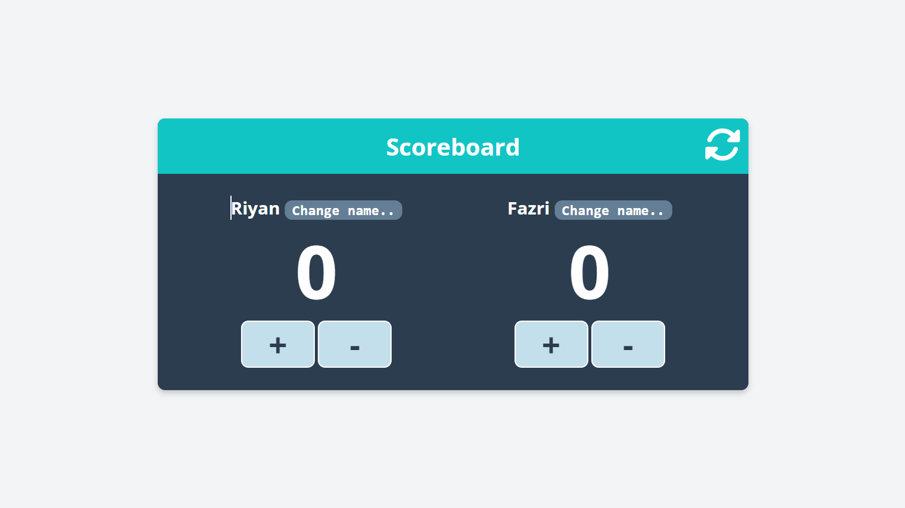

# Aplikasi Scoreboard

Aplikasi Scoreboard ini dibuat untuk membantu dalam mencatat skor dan mengelola nama tim. Aplikasi ini memungkinkan pengguna untuk menambahkan, mengurangi, dan mengubah nama tim dengan mudah.

## Fitur

- Menampilkan nama tim dan skor masing-masing tim.
- Mengubah nama tim dengan input dari pengguna.
- Menambahkan dan mengurangi skor dengan mudah.

## Cara Menggunakan

1. **Clone repository** ini ke dalam komputer Anda:
   ```bash
   git clone https://github.com/riyanfazrirahman/aplikasi-scoreboard.git
   ```
2. Buka file index.html di browser Anda untuk menjalankan aplikasi.
3. Ganti nama tim dengan mengklik tombol "Change name.." di samping nama tim.
4. Tambah atau kurang skor dengan mengklik tombol + atau - di bawah masing-masing tim.

## Screenshot



## Teknologi yang Digunakan

  
